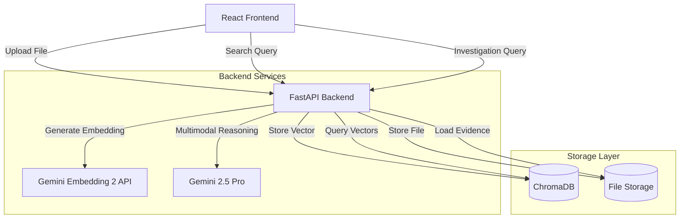

# Design Document: Multimodal Claims Investigator

## Overview

The multimodal claims investigator is a FastAPI-based backend service that enables claims adjusters to ingest, embed, store, and semantically search across videos, images, audio files, and PDFs. The system uses Google Gemini Embedding 2 API to project all media types into a unified vector space stored in ChromaDB, enabling cross-modal semantic search and AI-powered investigation using Gemini 2.5 Pro.

The architecture follows a modular design with clear separation of concerns:
- **ingest.py**: File upload and ingestion orchestration
- **embed.py**: Gemini Embedding 2 API wrapper for multimodal embeddings
- **search.py**: Semantic search endpoint
- **retrieval.py**: Multimodal investigation using Gemini 2.5 Pro
- **db.py**: ChromaDB client and collection management
- **frontend**: React UI for file upload and search

## Architecture

### High-Level Architecture



### Request Flow

**Ingestion Flow:**
1. User uploads file via React UI
2. FastAPI receives multipart form data
3. File validation (type, size, content)
4. File saved to disk with organized path structure
5. Gemini Embedding 2 generates embedding vector
6. Vector + metadata stored in ChromaDB
7. Success response with file ID returned

**Search Flow:**
1. User enters text query via React UI
2. FastAPI receives search request
3. Gemini Embedding 2 embeds the query text
4. ChromaDB performs vector similarity search
5. Top-k results with metadata returned
6. React UI displays results with similarity scores

**Investigation Flow:**
1. User asks natural language question via React UI
2. FastAPI receives investigation request
3. Gemini Embedding 2 embeds the question
4. ChromaDB retrieves top-k relevant evidence files
5. Evidence files loaded from disk
6. Gemini 2.5 Pro analyzes all evidence together
7. AI-generated investigation report returned
8. React UI displays answer with source references

## Components and Interfaces

### 1. Ingest Service (ingest.py)

**Responsibility:** Accept file uploads, orchestrate embedding generation, store files and vectors.

**API Endpoint:**
```python
POST /ingest
Content-Type: multipart/form-data

Parameters:
- file: UploadFile (required) - The media file to ingest
- claim_id: str (optional) - Associate file with a specific claim
- description: str (optional) - Human-readable description

Response (200):
{
  "file_id": "uuid-string",
  "filename": "dashcam_video.mp4",
  "modality": "video",
  "claim_id": "claim-12345",
  "status": "success"
}

Response (400):
{
  "error": "Unsupported file type",
  "supported_types": ["mp4", "mov", "jpg", "png", "mp3", "wav", "pdf"]
}
```

**Key Functions:**
```python
async def ingest_file(file: UploadFile, claim_id: str = "", description: str = "") -> dict:
    """
    Main ingestion handler.
    1. Validate file
    2. Save to disk
    3. Generate embedding
    4. Store in ChromaDB
    """

def validate_file(file: UploadFile) -> tuple[bool, str]:
    """
    Validate file type, size, and content.
    Returns (is_valid, error_message)
    """

async def save_file(file: UploadFile, claim_id: str) -> str:
    """
    Save file to disk with organized structure.
    Returns file path.
    """

def determine_modality(filename: str) -> str:
    """
    Determine modality (video/image/audio/document) from file extension.
    """
```

**File Storage Structure:**
```
uploads/
  claim-12345/
    video/
      dashcam_video.mp4
    image/
      damage_photo_1.jpg
      damage_photo_2.jpg
    audio/
      driver_statement.mp3
    document/
      police_report.pdf
  claim-67890/
    ...
```

### 2. Embedding Service (embed.py)

**Responsibility:** Wrapper for Gemini Embedding 2 API supporting all modalities.

**Key Functions:**
```python
async def embed_video(file_path: str) -> list[float]:
    """
    Generate embedding for video file.
    Uses Gemini Embedding 2 video modality.
    """

async def embed_image(file_path: str) -> list[float]:
    """
    Generate embedding for image file.
    Uses Gemini Embedding 2 image modality.
    """

async def embed_audio(file_path: str) -> list[float]:
    """
    Generate embedding for audio file.
    Uses Gemini Embedding 2 audio modality.
    """

async def embed_document(file_path: str) -> list[float]:
    """
    Generate embedding for PDF document.
    Uses Gemini Embedding 2 document modality.
    """

async def embed_text(text: str) -> list[float]:
    """
    Generate embedding for text query.
    Uses Gemini Embedding 2 text modality.
    """

async def embed_file(file_path: str, modality: str) -> list[float]:
    """
    Unified interface that routes to appropriate embedding function.
    """
```

**Gemini API Configuration:**
```python
import google.generativeai as genai

genai.configure(api_key=os.environ["GEMINI_API_KEY"])

EMBEDDING_MODEL = "models/embedding-002"
EMBEDDING_TASK_TYPE = "RETRIEVAL_DOCUMENT"  # For files
QUERY_TASK_TYPE = "RETRIEVAL_QUERY"  # For search queries
```

### 3. Database Service (db.py)

**Responsibility:** ChromaDB client management and vector operations.

**Key Functions:**
```python
def get_client() -> chromadb.Client:
    """
    Get or create ChromaDB client.
    Uses persistent storage.
    """

def get_collection() -> chromadb.Collection:
    """
    Get or create the main collection for evidence files.
    """

def store_embedding(
    embedding: list[float],
    metadata: dict,
    file_id: str
) -> str:
    """
    Store embedding vector with metadata in ChromaDB.
    Returns the stored document ID.
    """

def search_embeddings(
    query_embedding: list[float],
    top_k: int = 10,
    claim_id: str = ""
) -> dict:
    """
    Search for similar embeddings.
    Optionally filter by claim_id.
    Returns results with metadata and distances.
    """
```

**Metadata Schema:**
```python
{
  "file_id": "uuid-string",
  "filename": "dashcam_video.mp4",
  "modality": "video",  # video|image|audio|document
  "claim_id": "claim-12345",
  "path": "/uploads/claim-12345/video/dashcam_video.mp4",
  "file_size": 15728640,  # bytes
  "upload_timestamp": "2024-01-15T10:30:00Z",
  "description": "Dashcam footage from incident"
}
```

### 4. Search Service (search.py)

**Responsibility:** Semantic search endpoint for text queries.

**API Endpoint:**
```python
POST /search
Content-Type: application/json

Request:
{
  "query": "dashcam footage showing collision",
  "top_k": 10,
  "claim_id": "claim-12345"  // optional
}

Response (200):
{
  "results": [
    {
      "file_id": "uuid-1",
      "filename": "dashcam_video.mp4",
      "modality": "video",
      "claim_id": "claim-12345",
      "similarity": 0.89,
      "metadata": { ... }
    },
    ...
  ],
  "query": "dashcam footage showing collision",
  "total_results": 3
}
```

**Key Functions:**
```python
async def search(query: str, top_k: int = 10, claim_id: str = "") -> dict:
    """
    Main search handler.
    1. Embed query text
    2. Search ChromaDB
    3. Format and return results
    """

def calculate_similarity(distance: float) -> float:
    """
    Convert ChromaDB distance to similarity score (0-1).
    Uses formula: similarity = 1 / (1 + distance)
    """
```

### 5. Investigation Service (retrieval.py)

**Responsibility:** AI-powered multimodal investigation using Gemini 2.5 Pro.

**API Endpoint:**
```python
POST /investigate
Content-Type: application/json

Request:
{
  "question": "Does the driver's audio account match what the dashcam shows?",
  "claim_id": "claim-12345",  // optional
  "top_k": 6
}

Response (200):
{
  "answer": "Based on analysis of the dashcam video and driver audio statement...",
  "sources": [
    {
      "filename": "dashcam_video.mp4",
      "modality": "video",
      "claim_id": "claim-12345",
      "similarity": 0.92
    },
    {
      "filename": "driver_statement.mp3",
      "modality": "audio",
      "claim_id": "claim-12345",
      "similarity": 0.87
    }
  ],
  "model_used": "gemini-2.5-pro-preview-05-06"
}
```

**Key Functions:**
```python
async def investigate(question: str, claim_id: str = "", top_k: int = 6) -> dict:
    """
    Main investigation handler.
    1. Embed question
    2. Retrieve top-k evidence files
    3. Load files from disk
    4. Send to Gemini 2.5 Pro for analysis
    5. Return investigation report
    """

def _call_gemini(question: str, metadatas: list, distances: list) -> tuple[str, list]:
    """
    Synchronous Gemini 2.5 Pro call.
    Builds multimodal content with all evidence files.
    """

def _mime_for_modality(modality: str, suffix: str) -> str:
    """
    Map file extension to MIME type for Gemini API.
    """
```

**System Prompt for Gemini 2.5 Pro:**
```
You are an expert insurance claims investigator AI.
You will be given a question from a claims adjuster and a set of evidence files
(which may include dashcam video, damage photos, audio recordings, and PDF reports).

Your job:
1. Carefully analyse ALL provided evidence together.
2. Directly answer the adjuster's question with specific references to the evidence.
3. Note any inconsistencies between files (e.g. audio vs visual account mismatch).
4. Be concise, factual, and highlight the most important finding first.
5. If evidence is insufficient to answer, say so clearly.

Never make up facts. Only state what the evidence actually shows.
```

### 6. Frontend (React)

**Responsibility:** User interface for file upload, search, and investigation.

**Key Components:**

```typescript
// FileUpload.tsx
interface FileUploadProps {
  onUploadSuccess: (fileId: string) => void;
}

// Features:
// - Drag-and-drop zone
// - File type validation
// - Upload progress indicator
// - Claim ID input (optional)
// - Description input (optional)

// SearchBox.tsx
interface SearchBoxProps {
  onSearchResults: (results: SearchResult[]) => void;
}

// Features:
// - Text input for queries
// - Top-k slider
// - Claim ID filter (optional)
// - Loading indicator
// - Results display with similarity scores

// InvestigationPanel.tsx
interface InvestigationPanelProps {
  onInvestigationComplete: (report: InvestigationReport) => void;
}

// Features:
// - Natural language question input
// - Claim ID filter (optional)
// - Top-k evidence slider
// - Loading indicator
// - Investigation report display
// - Source evidence list with similarity scores
```

**API Client:**
```typescript
// api.ts
export async function uploadFile(
  file: File,
  claimId?: string,
  description?: string
): Promise<UploadResponse>;

export async function search(
  query: string,
  topK: number = 10,
  claimId?: string
): Promise<SearchResponse>;

export async function investigate(
  question: string,
  claimId?: string,
  topK: number = 6
): Promise<InvestigationResponse>;
```

## Data Models

### File Upload Request
```python
class FileUploadRequest:
    file: UploadFile
    claim_id: Optional[str] = ""
    description: Optional[str] = ""
```

### Embedding Vector
```python
class EmbeddingVector:
    vector: list[float]  # Dimension determined by Gemini Embedding 2
    modality: str  # "video" | "image" | "audio" | "document" | "text"
```

### File Metadata
```python
class FileMetadata:
    file_id: str
    filename: str
    modality: str
    claim_id: str
    path: str
    file_size: int
    upload_timestamp: str
    description: str
```

### Search Request
```python
class SearchRequest:
    query: str
    top_k: int = 10
    claim_id: Optional[str] = ""
```

### Search Result
```python
class SearchResult:
    file_id: str
    filename: str
    modality: str
    claim_id: str
    similarity: float
    metadata: FileMetadata
```

### Investigation Request
```python
class InvestigationRequest:
    question: str
    claim_id: Optional[str] = ""
    top_k: int = 6
```

### Investigation Report
```python
class InvestigationReport:
    answer: str
    sources: list[SourceReference]
    model_used: str

class SourceReference:
    filename: str
    modality: str
    claim_id: str
    similarity: float
```

## Correctness Properties

A property is a characteristic or behavior that should hold true across all valid executions of a system—essentially, a formal statement about what the system should do. Properties serve as the bridge between human-readable specifications and machine-verifiable correctness guarantees.

### Property 1: Multimodal File Acceptance

*For any* valid file of a supported modality (video, image, audio, or PDF), the Ingest_Service should accept the file, process it, and return a success response with a file identifier.

**Validates: Requirements 1.1, 1.2, 1.3, 1.4, 1.6**

### Property 2: Unsupported File Rejection

*For any* file with an unsupported file extension, the Ingest_Service should reject the file and return a descriptive error message listing supported types.

**Validates: Requirements 1.5**

### Property 3: Consistent Embedding Dimensionality

*For any* valid file of any supported modality (video, image, audio, document), the Embedding_Service should return an embedding vector with consistent dimensionality, ensuring all embeddings exist in the same vector space.

**Validates: Requirements 2.1, 2.2, 2.3, 2.4, 2.6**

### Property 4: Embedding Storage Round-Trip

*For any* generated embedding vector with metadata, storing it in ChromaDB and then retrieving it should return the same vector and metadata, demonstrating successful persistence.

**Validates: Requirements 3.1**

### Property 5: Required Metadata Fields

*For any* stored vector in ChromaDB, the associated metadata should contain all required fields: filename, file type (modality), upload timestamp, file size, and file path.

**Validates: Requirements 3.2**

### Property 6: Storage Success Returns Identifier

*For any* successful storage operation, the Ingest_Service should return a unique identifier that can be used to reference the stored vector.

**Validates: Requirements 3.3**

### Property 7: Query Embedding Generation

*For any* text query submitted to the Search_Service, an embedding vector should be generated using Gemini Embedding 2 API.

**Validates: Requirements 4.1**

### Property 8: Search Result Limit Enforcement

*For any* search query with a specified top_k parameter, the number of returned results should not exceed that limit.

**Validates: Requirements 4.2, 4.5**

### Property 9: Search Results Include Complete Information

*For any* search result returned by the Search_Service, it should include both the complete metadata for the matching file and a similarity score.

**Validates: Requirements 4.3, 4.4**

### Property 10: Malformed Request Error Handling

*For any* malformed API request (missing required fields, invalid JSON, wrong content type), the system should return a 400 status code with a descriptive error message.

**Validates: Requirements 5.3**

### Property 11: Successful Request Status Code

*For any* valid and successful API request, the system should return a 200 status code with the appropriate response payload.

**Validates: Requirements 5.4**

### Property 12: File Size Validation

*For any* file upload where the file size exceeds the configured maximum limit, the Ingest_Service should reject the upload and return an error message indicating the size limit.

**Validates: Requirements 6.1**

### Property 13: File Extension Validation

*For any* file upload with an extension not in the whitelist of supported types, the Ingest_Service should reject the upload and return an error message.

**Validates: Requirements 6.2**

### Property 14: Specific Validation Error Messages

*For any* validation failure (size, type, empty file), the error message returned should specifically indicate which validation check failed.

**Validates: Requirements 6.4**

### Property 15: Investigation Evidence Limit

*For any* investigation request with a specified top_k parameter, the number of evidence files retrieved and analyzed should not exceed that limit.

**Validates: Requirements 8.1, 8.6**

### Property 16: Investigation Evidence Sent to LLM

*For any* investigation request where evidence files are retrieved, all retrieved files should be included in the multimodal content sent to Gemini 2.5 Pro for analysis.

**Validates: Requirements 8.2**

### Property 17: Claim-Scoped Investigation

*For any* investigation request with a specified claim_id filter, all retrieved evidence files should belong to that specific claim.

**Validates: Requirements 8.5**

### Property 18: Investigation Report Includes Sources

*For any* investigation report returned by the Investigation_Service, it should include source references listing which evidence files were analyzed, along with their similarity scores.

**Validates: Requirements 8.8**

### Property 19: File Storage and Retrieval Round-Trip

*For any* media file ingested by the system, it should be stored on disk with the path recorded in metadata, and later the file should be retrievable from disk using that stored path.

**Validates: Requirements 9.1, 9.2, 9.4**

### Property 20: Claim ID Metadata Inclusion

*For any* file ingested with a claim_id parameter, the stored metadata in ChromaDB should include that claim_id, enabling scoped retrieval.

**Validates: Requirements 9.3**

## Error Handling

The system implements comprehensive error handling across all layers to ensure robustness and provide clear feedback to users.

### API Layer Error Handling

**HTTP Status Codes:**
- 200: Successful request
- 400: Client error (malformed request, validation failure)
- 500: Server error (internal failure, external service unavailable)

**Error Response Format:**
```python
{
  "error": "Descriptive error message",
  "error_type": "ValidationError" | "StorageError" | "EmbeddingError" | "NotFoundError",
  "details": {
    // Additional context-specific information
  }
}
```

### Validation Errors

**File Upload Validation:**
- Unsupported file type → 400 with list of supported types
- File size exceeds limit → 400 with maximum size
- Empty file → 400 with "File cannot be empty"
- Missing required fields → 400 with list of missing fields

**Search/Investigation Validation:**
- Empty query → 400 with "Query cannot be empty"
- Invalid top_k value → 400 with "top_k must be positive integer"
- Malformed JSON → 400 with "Invalid JSON payload"

### External Service Errors

**Gemini API Failures:**
- API unavailable → 500 with "Embedding service temporarily unavailable"
- Rate limit exceeded → 429 with "Rate limit exceeded, please retry"
- Authentication error → 500 with "Embedding service authentication failed"
- Invalid file format → 400 with "File format not supported by embedding service"

**ChromaDB Failures:**
- Database unavailable → 500 with "Storage service temporarily unavailable"
- Connection timeout → 500 with "Storage service connection timeout"
- Write failure → 500 with "Failed to store embedding"
- Query failure → 500 with "Failed to retrieve results"

### File System Errors

**Storage Errors:**
- Disk full → 500 with "Insufficient storage space"
- Permission denied → 500 with "File storage permission error"
- File not found during retrieval → 404 with "Evidence file not found"

**Investigation Service Handling:**
- Missing evidence files are logged but don't crash the investigation
- Report includes note about missing files: "[Could not load {filename}: File not found]"
- Investigation continues with available evidence

### Atomic Operations

**Ingestion Atomicity:**
- If embedding generation fails, uploaded file is deleted
- If storage fails, uploaded file is deleted
- No partial data left in system on failure
- Transaction-like behavior: all-or-nothing

**Error Recovery:**
- Failed operations are logged with full context
- Retry logic for transient failures (network timeouts)
- Graceful degradation where possible

## Testing Strategy

The testing strategy employs a dual approach combining unit tests for specific examples and edge cases with property-based tests for universal correctness properties.

### Property-Based Testing

Property-based tests validate that universal properties hold across many randomly generated inputs. This approach catches edge cases that might be missed by example-based testing.

**Testing Library:** Hypothesis (Python)

**Configuration:**
- Minimum 100 iterations per property test
- Each test tagged with feature name and property number
- Tag format: `# Feature: multimodal-ingest, Property {N}: {property_text}`

**Property Test Coverage:**

1. **File Ingestion Properties (Properties 1-2)**
   - Generate random valid files of each modality
   - Generate random invalid file types
   - Verify acceptance/rejection behavior

2. **Embedding Properties (Property 3)**
   - Generate files of different modalities
   - Verify all embeddings have same dimensionality
   - Verify embeddings are non-empty vectors

3. **Storage Properties (Properties 4-6)**
   - Generate random embeddings and metadata
   - Verify round-trip storage and retrieval
   - Verify all required metadata fields present
   - Verify unique identifiers returned

4. **Search Properties (Properties 7-9)**
   - Generate random text queries
   - Generate random top_k values
   - Verify result count limits
   - Verify result completeness (metadata + scores)

5. **Validation Properties (Properties 12-14)**
   - Generate files exceeding size limits
   - Generate files with invalid extensions
   - Verify specific error messages

6. **Investigation Properties (Properties 15-20)**
   - Generate random questions and claim_ids
   - Verify evidence count limits
   - Verify claim filtering
   - Verify source references in reports
   - Verify file storage/retrieval round-trips

### Unit Testing

Unit tests validate specific examples, integration points, and error conditions that are difficult to express as universal properties.

**Testing Framework:** pytest (Python)

**Unit Test Coverage:**

1. **API Endpoint Tests**
   - Test POST /ingest with valid multipart form data
   - Test POST /search with valid JSON payload
   - Test POST /investigate with valid JSON payload
   - Test malformed requests return 400
   - Test internal errors return 500

2. **Embedding Service Tests**
   - Test each modality-specific embedding function
   - Test unified embed_file routing
   - Mock Gemini API responses
   - Test API error propagation

3. **Database Service Tests**
   - Test ChromaDB client initialization
   - Test collection creation
   - Test embedding storage and retrieval
   - Test claim_id filtering in queries
   - Mock database failures

4. **File Management Tests**
   - Test file storage directory structure
   - Test file path generation
   - Test modality determination from extensions
   - Test file cleanup on errors

5. **Investigation Service Tests**
   - Test evidence file loading
   - Test MIME type mapping
   - Test multimodal content construction
   - Mock Gemini 2.5 Pro responses
   - Test missing file handling

6. **Edge Cases**
   - Empty file upload
   - Empty search results
   - Missing evidence files during investigation
   - Concurrent file uploads
   - Very large files (near size limit)

### Integration Testing

Integration tests validate end-to-end workflows across multiple components.

**Integration Test Scenarios:**

1. **Complete Ingestion Flow**
   - Upload file → Generate embedding → Store in DB → Verify retrieval

2. **Complete Search Flow**
   - Ingest multiple files → Search with query → Verify relevant results

3. **Complete Investigation Flow**
   - Ingest evidence files → Ask question → Verify report with sources

4. **Cross-Modal Search**
   - Ingest files of different modalities → Search → Verify cross-modal results

5. **Claim-Scoped Operations**
   - Ingest files with different claim_ids → Search/investigate with filter → Verify scoping

### Frontend Testing

**Testing Framework:** Jest + React Testing Library

**Frontend Test Coverage:**

1. **Component Tests**
   - FileUpload component renders and accepts files
   - SearchBox component renders and submits queries
   - InvestigationPanel component renders and submits questions
   - Results display correctly with metadata

2. **Integration Tests**
   - File upload triggers API call and shows success
   - Search triggers API call and displays results
   - Investigation triggers API call and displays report
   - Error messages display on failures

3. **User Interaction Tests**
   - Drag-and-drop file upload
   - Click-to-browse file selection
   - Form submission
   - Loading states during async operations

### Test Data Management

**Synthetic Test Data:**
- Small sample files for each modality (video, image, audio, PDF)
- Stored in `tests/fixtures/` directory
- Version controlled for reproducibility

**Mock Responses:**
- Mock Gemini API responses for consistent testing
- Mock ChromaDB responses for isolation
- Mock file system operations where appropriate

### Continuous Integration

**CI Pipeline:**
1. Run all unit tests
2. Run property-based tests (100 iterations each)
3. Run integration tests
4. Generate coverage report (target: >80%)
5. Fail build on any test failure

**Test Execution Time:**
- Unit tests: < 30 seconds
- Property tests: < 2 minutes
- Integration tests: < 1 minute
- Total: < 4 minutes

